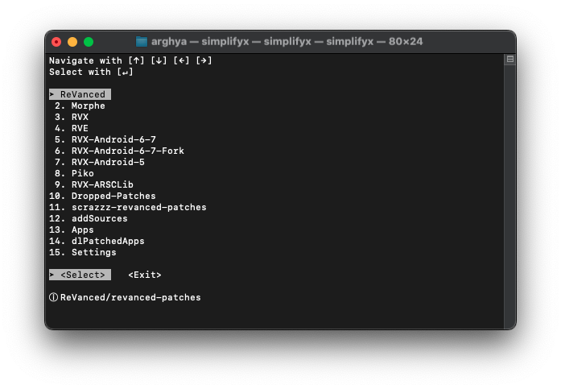

<pre>
▄▀▀ █ █▄ ▄█ █▀▄ █   █ █▀ ▀▄▀ 
▄██ █ █ ▀ █ █▀  █▄▄ █ █▀  █  
</pre>
<div align="center">


# Simplify

**A Simple, feature-rich shell script designed to automate APK patching process using ReVanced patcher.**


</div>

## 📱 Preview

<div align="center">
  <a href="https://youtu.be/" target="_blank">
    
  </a>
  <p><i>Click the image above to watch the demo video</i></p>
</div>

<br />

## 🤌 Features

* **😎Simple:** Easy to use.

> [!TIP]
> **SimplifyNext** is currently in development with next-level features!
> Explore SimplifyNext on the [**next**](../../tree/next) branch.

## 🛠 Usage


Open [Termux](https://github.com/termux/termux-app/releases) and paste following command and press `Enter` key:
```sh
curl -L --progress-bar -o "$HOME/.Simplify.sh" "https://raw.githubusercontent.com/arghya339/Simplify/refs/heads/main/Termux/Simplify.sh" && bash "$HOME/.Simplify.sh"
```
Run Simplify with these commands in Termux:
```
simplify
```

## 🜲 Thanks & Credits

- [ReVanced](https://github.com/ReVanced)
- [Morphe](https://github.com/MorpheApp)

## 💖 Support

This project is open-source and free. If you enjoy using it, consider buying me a coffee!

[](https://www.paypal.com/paypalme/arghyadeep339)

---

<div align="center">
  <p>Made with 💜 for Geeks by <a href="https://github.com/arghya339">Arghya</a></p>
</div>
