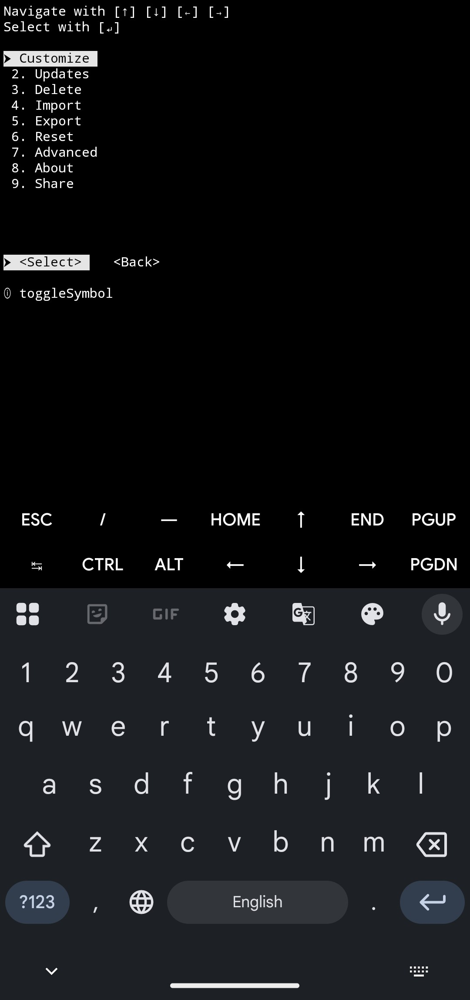
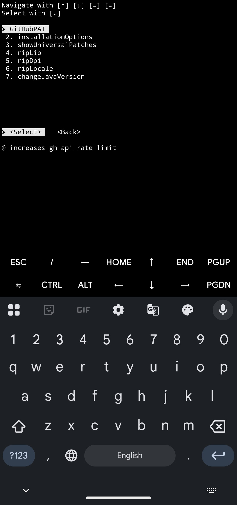
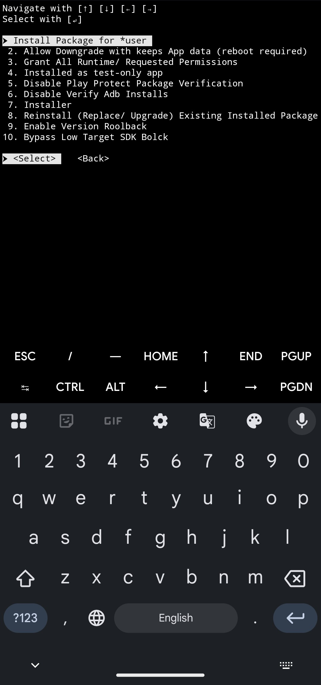
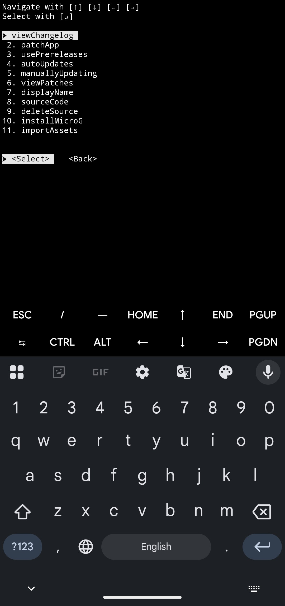
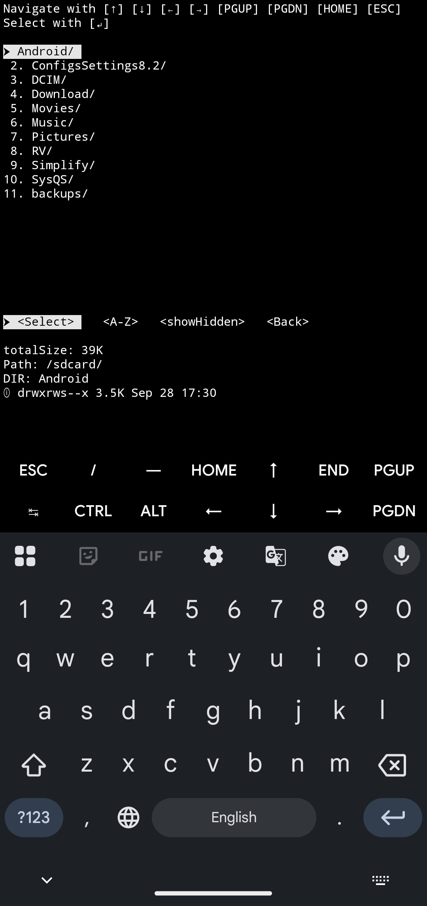
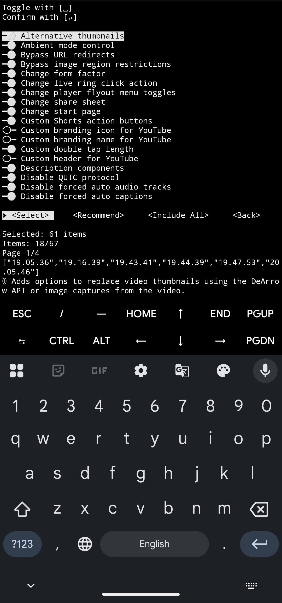
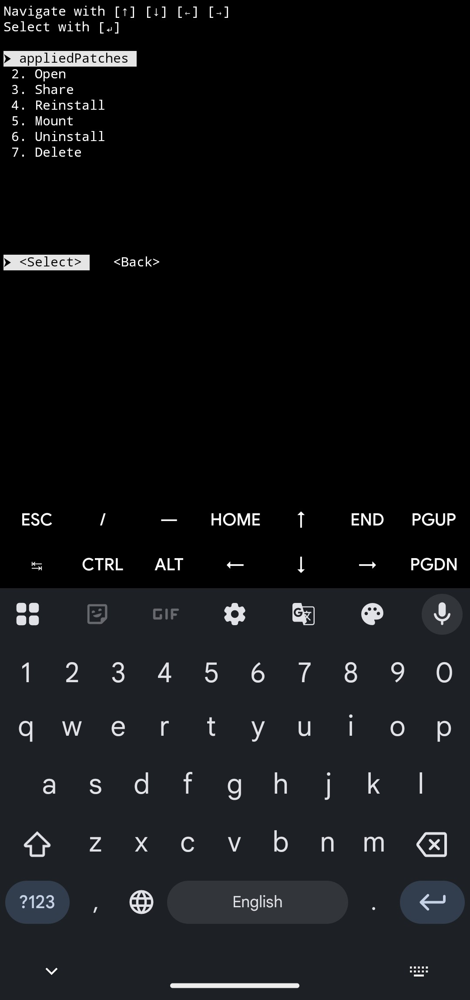

<pre>
   _____ _                 ___ ____    ____  
  / ___/(_)___ ___  ____  / (_) __/_  _\ \ \ 
  \__ \/ / __ `__ \/ __ \/ / / /_/ / / /\ \ \
 ___/ / / / / / / / /_/ / / / __/ /_/ / / / /
/____/_/_/ /_/ /_/ .___/_/_/_/  \__, / /_/_/ 
                /_/            /____/        
</pre>
<div align="center">

# SimplifyNext

**A feature-rich, cross-platform shell script designed to automate APK patching process using ReVanced patcher.**


</div>

## 📱 Preview

<div align="center">
  <a href="https://youtu.be/NJI1n1otUM8" target="_blank">
    
  </a>
  <p><i>Click the image above to watch the demo video</i></p>
</div>

<br />

<div align="center">

  
  
  
  
  
  
  
</div>

## 💪 Features

* **🎮 Interactive:** Full keyboard navigation with visual feedback.
* **🧑‍💻 Simple Interface:** Easy to use.
* **🧑‍🔧 Manage Patch-options:** User-friendly Patch-options Editor.
* **💁 Lightweight:** Smaller size than any other tool.
* **🚀 Faster:** Efficient than other tools.
* **🖥️ Multi-Platform:** Android, Linux (Debian, Fedora, Arch, SUSE, Alpine), macOS and ~~Windows~~ support.
* **⏱️ Save Time:** Save your valuable time by downloading pre-patched apps from a trusted source without patching them yourself.
* **🛜 Hybrid Mode:** Works without internet connection when offline, seamlessly transitions to online features when connected.
* **📁 File Selector:** Built-in feature rich file browser and section interface.
* **🤝 APKMirror Integration:** Download stock APKs directly from APKMirror.
* **🧩 Split APK Support:** Automatically converts .apks, .apkm, and .xapk split-file formats into standalone .apk files during patching.
* **⚡ Aria2 Integration:** Faster, resumable downloads.
* **🎨 Customize:** choose your preferred symbols for toggle-menu, menu-buttons, secure-prompt.
* **🔄 Self-Updating:** Automatically checks for and installs the latest version of the tool.
* **🧹 Clean Options:** Multiple cleanup choices (delete stock APKs, patched APK, CLI, or patches file).
* **🤖 Auto Cleanup:** Automatically deletes patched APK after installation and stock APK after successful patching.
* **📥 Import:** Import Patch Selection and Android Keystore from ReVanced Manager.
* **📤 Export:** Export Patch Selection and Android Keystore for use in ReVanced Manager.
* **🔑 Keystore Management:** Generate new android keystores for APK signing.
* **\*\* GitHub PAT Support:** Increases GH API rate limit from 60 to 5000 requests/hour.
* **👾 Shizuku support:** rish installer support.
* **😎 Smart Install Flow:** Automatically cascades from root (su) to Shizuku (rish) to standard (session) installer based on availability.
* **🎭 Root:** Support mount installation.
* **🛡️ Security Bypass:** Disable Play Protect verification to prevent installation blocking of patched APK.
* **🌐 Universal Patches:** Enable or disable universal patches across all applications.
* **📚 Library Stripping:** Remove unused native libraries for a smaller APK size.
* **📱 DPI Optimization:** Strip unused density resources to reduce APK size.
* **🌍 Locale Reduction:** Remove unnecessary language resources for a more compact APK.
* **📲 Java Version Switching:** Easily switch between Java 17, 21, 25
* **🧠 Java Memory Limits:** Configure JVM heap size (memory allocation) for optimal patching performance.
* **🔍 View Applied Patches:** See all patches currently applied to installed apps.
* **🦾 Perform Operations:** Execute install, uninstall, mount, unmount, delete operations.
* **➕ Custom Sources:** Add custom patches repositories.
* **📋 View Changelog:** See what's new in patches directly in terminal.
* **🔬 Prerelease Patches:** Use upcoming patch versions before their official stable release.
* **🔭 View Patches:** View all available patches directly within terminal interface with full details.
* **</> Source Code:** Open Patches source code URLs directly in browser.
* **✨ More:** and many more... 🙃

## 🛠 Installation & Usage

      

[](https://github.com/termux/termux-app/releases)
```sh
curl -sL -o "$HOME/.simplifyx.sh" "https://raw.githubusercontent.com/arghya339/Simplify/refs/heads/next/bash/simplifyx.sh" && bash ~/.simplifyx.sh
```
```sh
wget -q -O "$HOME/.simplifyx.sh" "https://raw.githubusercontent.com/arghya339/Simplify/refs/heads/next/bash/simplifyx.sh" && bash ~/.simplifyx.sh
```

```
simplifyx
```


[](https://github.com/PowerShell/PowerShell/releases)
```pwsh

```
```pwsh

```

## 🜲 Thanks & Credits

- [ReVanced](https://github.com/ReVanced)
- [Morphe](https://github.com/MorpheApp)

## 💖 Support

This project is open-source and free. If you enjoy using it, consider buying me a coffee!

[](https://www.paypal.com/paypalme/arghyadeep339)

---

<div align="center">
  <p>Made with 💜 for Geeks by <a href="https://github.com/arghya339">Arghya</a></p>
</div>
