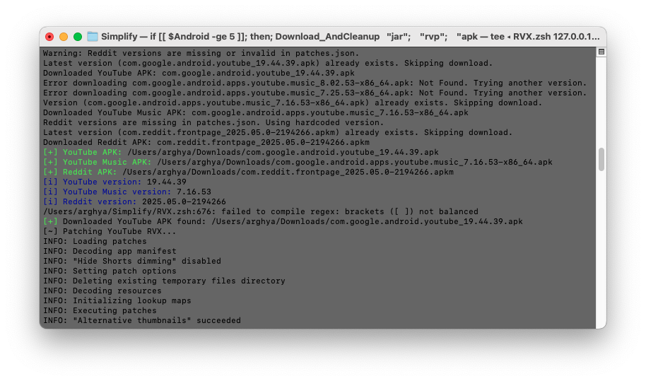
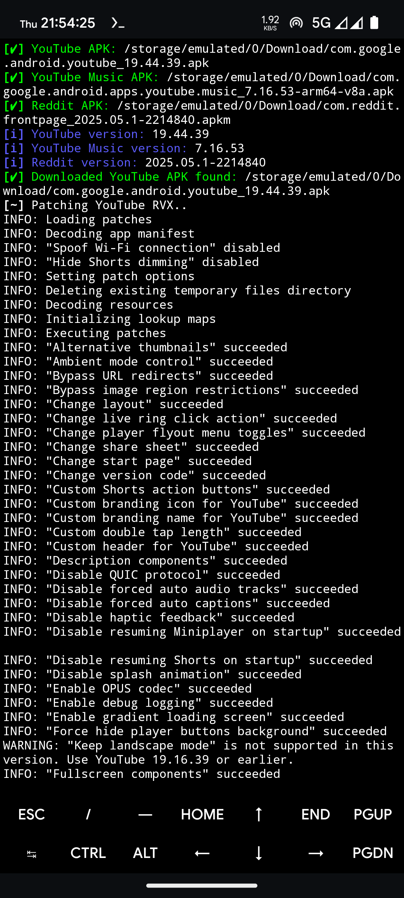

<h1 align="center">Simplify</h1>
<p align="center">
A Simple Cross Platform Automated ReVanced Shell Script for Patching apk
<br>
<br>

<br>
<b> This Script works on Android devices, macOS and Windows! </b>
<br>

## Purpose
- This script automates the process of patching stock apk using [`ReVanced`](https://github.com/ReVanced/revanced-documentation/tree/main/docs/revanced-development) pathing method.

## Prerequisites
- Android device with USB debugging enabled (and enable it form Developer options and you can enable Developer options by tapping the build number 7 times from Device Settings)
- Android 5 and up device
- A PC [Windows 10 1809 (build 17763) or later (Windows 11)] with Microsoft [DesktopAppInstaller](https://apps.microsoft.com/detail/9nblggh4nns1) known as [winget-cli](https://github.com/microsoft/winget-cli/releases/latest) or macOS or Android device with [Termux](https://github.com/termux/termux-app/releases/) with working internet connection 
- Latest Microsoft PowerShell (and you can check PowerShell Version uisng following command ~ `$PSVersionTable`) or Terminal (~ `zsh --version`) or Termux (~ `termux-info`)

## Usage
### 
  - Open [Termux](https://github.com/termux/termux-app/releases) and type following command and press `Enter` key twice:
  
  ```sh
  pkg update && pkg install --only-upgrade apt bash coreutils openssl -y
  ```
  - run the script with the following command:
  ```sh
  curl -L --progress-bar -o "$HOME/.Simplify.sh" "https://raw.githubusercontent.com/arghya339/Simplify/refs/heads/main/Termux/Simplify.sh" && bash "$HOME/.Simplify.sh"
  ```
  - Run Simplify with these commands in Termux:
  ```
  simplify
  ```

### 
  - Open `Terminal` and run the script with the following command:
   
  ```
  curl -L "https://raw.githubusercontent.com/arghya339/Simplify/refs/heads/main/Terminal/RVX.zsh" -o "$HOME/Downloads/RVX.zsh"
  ```

  ```
  zsh $HOME/Downloads/RVX.zsh
  ```

## Dependencies
universal
["revanced-cli"](https://github.com/inotia00/revanced-cli) [[GNU 3]](https://github.com/inotia00/revanced-cli/blob/main/LICENSE),
["revanced-patches"](https://github.com/inotia00/revanced-patches) [[GNU 3]](https://github.com/inotia00/revanced-patches/blob/revanced-extended/LICENSE),
[VancedMicroG](https://github.com/inotia00/VancedMicroG) [[Apache 2]](https://github.com/inotia00/VancedMicroG/blob/master/LICENSE)

macOS
["brew"](https://github.com/Homebrew/brew) [[BSD 2]](https://github.com/Homebrew/brew/blob/master/LICENSE.txt), ["Java"](https://www.java.com/en/download/) [GFTC], ["Android SDK"](https://developer.android.com/tools) [Apache 2.0], ["Python"](https://www.python.org/downloads/) [PSF / GPL], ["jq"](https://github.com/jqlang/jq) [[MIT]](https://github.com/jqlang/jq/blob/master/COPYING), ["APKEditor"](https://github.com/REAndroid/APKEditor) [[Apache 2.0]](https://github.com/REAndroid/APKEditor/blob/master/LICENSE)

Windows
["Chocolatey"](https://github.com/chocolatey/choco) [[Apache 2.0]](https://github.com/chocolatey/choco/blob/develop/LICENSE), ["Java"](https://www.java.com/en/download/) [GFTC], ["Android SDK"](https://developer.android.com/tools) [Apache 2.0], ["Python"](https://www.python.org/downloads/) [PSF / GPL], ["jq"](https://github.com/jqlang/jq) [[MIT]](https://github.com/jqlang/jq/blob/master/COPYING), ["APKEditor"](https://github.com/REAndroid/APKEditor) [[Apache 2.0]](https://github.com/REAndroid/APKEditor/blob/master/LICENSE)

Android
["Java"](https://www.java.com/en/download/) [GFTC], ["Python"](https://www.python.org/downloads/) [PSF / GPL], ["jq"](https://github.com/jqlang/jq) [[MIT]](https://github.com/jqlang/jq/blob/master/COPYING), ["APKEditor"](https://github.com/REAndroid/APKEditor) [[Apache 2.0]](https://github.com/REAndroid/APKEditor/blob/master/LICENSE)

## How it works (_[Demo on YouTube](https://youtube.com/)_)





## Disclaimer
- This script is for educational purposes only. 
- Modifying and reinstalling APKs can be risky and may violate app terms of service or legal regulations. 
- Use it responsibly and at your own risk.

## Developer info
- Powered by [ReVanced](https://github.com/ReVanced/) and [RVX](https://github.com/inotia00/revanced-patches)
- Developer: [@arghya339](https://github.com/arghya339)

## Happy Patching!
